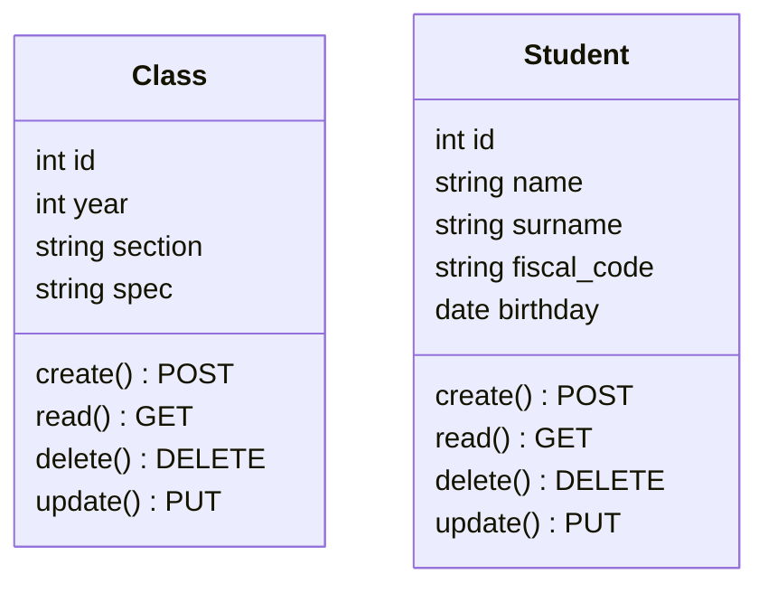

# ProgettoClassManager
### Descrizione:
> Il progetto ha lo scopo di visualizzare e gestire, in modo semplificato, gli alunni di un certo istituto scolastico
in un certo anno scolastico.

### Tecnologie utilizzate:
+ PHP (BackEnd)
+ JSON (scambio dati)
+ Docker
+ MySql (PHPMYADMIN)
+ Apache
+ REACT (FrontEnd)

## TaskList
- [ ] Creazione Progetto (organizzato in struttura) & Repo
- [ ] Creazione classi & Database(nome:school)
- [ ] Sviluppo codice (base progetto gamers)
- [ ] FrontEnd React

# BackEnd

- ## Classi


- # EntryPoint
- ### GET
    + /classi/ -&gt; JSON elenco classi
    + /classi/id -&gt; JSON dettaglio classe
    + /classi/id/alunni -&gt; JSON elenco alunni di una classe
    + /alunni/ -&gt; JSON elenco totale degli alunni
    + /alunni/id -&gt; JSON dettaglio dati alunno
- ### POST
    + /classi/ -&gt; inserimento dati nuova classe
    + /alunni/ -&gt; inserimento dati nuovo alunno
- ### PUT
    + /classi/id -&gt; modifica dati classe
    + /alunni/id -&gt; modifica dati alunno id
- ### DELETE
    + /alunni/id -&gt; modifica dati alunno id
    + /classi/id -&gt; elimina classe

# DATABASE

```mermaid
erDiagram
    class ||--|{ student : have
    class {
        int(A_I) id
        int year
        string section
        string spec
    }
    student
    student {
        int(A_I) id
        string name
        string surname
        string fiscal_code
        date birthday
        int(FK) class_id 
    }


```
# FrontEnd

